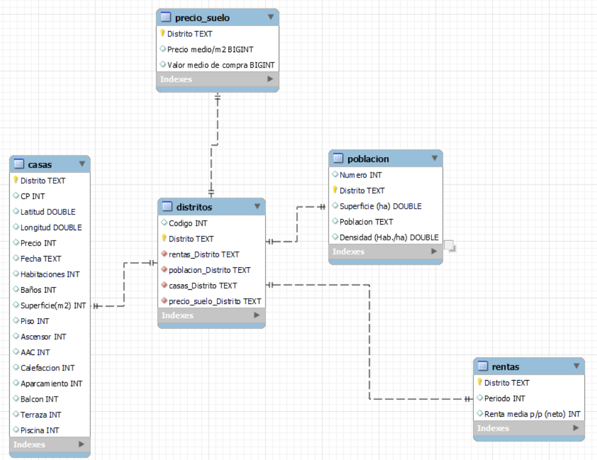

# 🏠 REAL ESTATE ETL 🏠
En este proyecto he querido utilizar las bondades de la ETL para indagar sobre el precio de la vivienda en Madrid capital en 2023, analizando cada situación por distrito, en relación a su población, renta media y demanda para cada uno de ellos, a través del precio del suelo y una base de datos de vivienda extraida directamente desde una web de venta y alquiler de las mismas. El alcance del proyecto no es analizar en profundidad las posible correlaciones entre las fuentes, sino en el proceso de extracción, transformación y carga de los datos obtenidos en una basa de datos para una posible utilidad en el futuro.

## 🎯 OBJETIVOS DEL PROYECTO
1º Crear un repositorio en GitHub

2º Explorar el problema que queremos abordad, investigar posibles fuente de información que nos resulten útiles y establecer un objetivo claro como finalidad de nuestro proyecto.

3º Extraer datos de, en este caso, páginas web y base de datos en formato csv.

4º Aplicar las herramientas, técnicas y metodologías aprendidas para realizar todo el proceso de extracción así como del filtrado y limpieza de los datos extraídos.

Librerías utilizadas: Pandas, Numpy, Regex, Selenium, BeautifulSoup...

5º Una vez trasnformados, cargar de los datos a SQL y establecer en dicho programa las relaciones que, posteriormente, nos ayudarán a realizar las consultas que deseemos.

## ⛏ EXTRACCIÓN DE LOS DATOS
La extracción de datos será realizada, principalmente, con la librería Selenium, que nos permite extraer directamente los datos desde un software controlador de nuestro navegador.
Para este proyecto, se han utilizado en las páginas web de Fotocasa y Wikipedia.
Por otra parte, se han obtenido bases de datos en formato csv desde la página del Ayuntamiento de Madrid y el INE.

## 💩 LIMPIEZA DE DATOS Y TRANSFORMACIÓN
Los datos escogidos vienen bastante limpios de nulos, por lo que me he centrado en corregir elementos tales como distribución y nombre de columnas, filtrado de filas, modificación de tipos de datos y otras modificaciones para cuadrar las diferentes fuentes de datos obtenidas.

## 🐬 IMPORTACIÓN A SQL
Una vez limpios y transformados, nuestros datos son subidos a una base de datos en SQL, donde una tabla central hace de enlace para las demás, relacionando así todos ellas para luego realizar las consultas que deseemos. Como extra, se han realizado algunas consultas para reforzar la solidez y coherencia de los datos obtenidos, las cuales se pueden hallar en la carpeta "Notebooks", dentro del propio directorio del proyecto.

EER

## 📝 CONCLUSIÓN
La ETL es un proceso indispensable en el mundo del análisis de datos por su importancia a la hora de extraer y constrastar información vital para una empresa o particular a la hora de analizar datos concretos que sean valiosos para guardar en una base de datos para un futuro uso de los mismo

